# https://reactnative.dev/docs/getting-started-without-a-framework

## Get Started Without a Framework

### Step 1: Creating a new application
    You can use React Native Community CLI to generate a new project. Let's create a new React Native project called "AwesomeProject":
    
        npx @react-native-community/cli@latest init AwesomeProject

        

### open project in android studio

    

### Step 2: Start Metro
    Metro is the JavaScript build tool for React Native. To start the Metro development server, run the following from your project folder:
    
        npm start

        

### Step 3: Start your application

    Let Metro Bundler run in its own terminal. Open a new terminal inside your React Native project folder. Run the following:

    npm run android

### Step 4: Modifying your app

    
    Now that you have successfully run the app, let's modify it.
    
    Open App.tsx in your text editor of choice and edit some lines.
    Press the R key twice or select Reload from the Dev Menu (Ctrl + M) to see your changes!

### step 5 : git user, email check

### step 6 : React Native WebView Getting Started Guide

    https://github.com/react-native-webview/react-native-webview/blob/HEAD/docs/Getting-Started.md

    1. Add react-native-webview to your dependencies
        $ npm install --save react-native-webview

    2. Link native dependencies
        react-native link react-native-webview

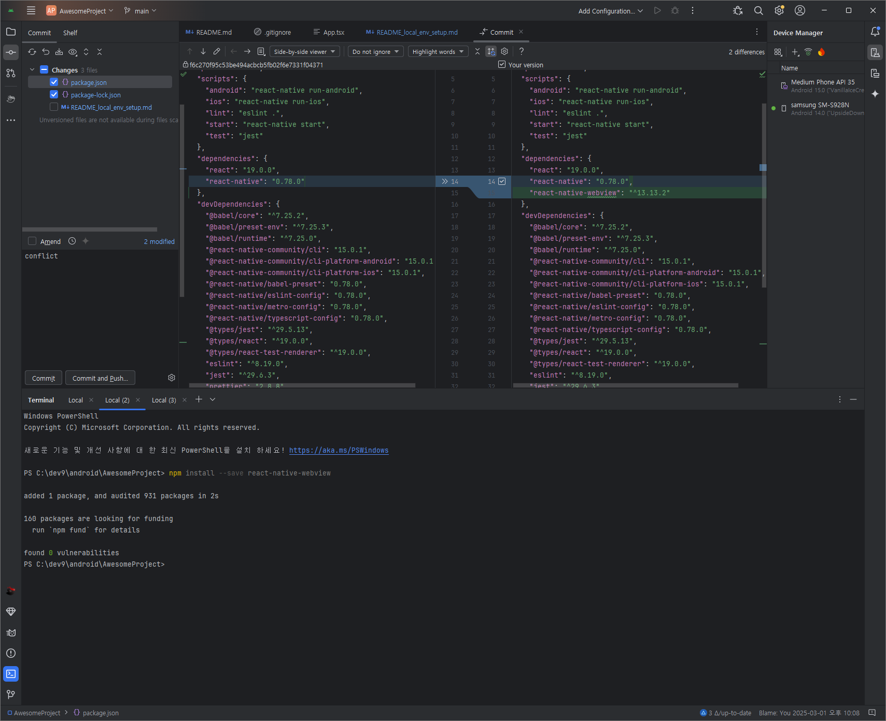

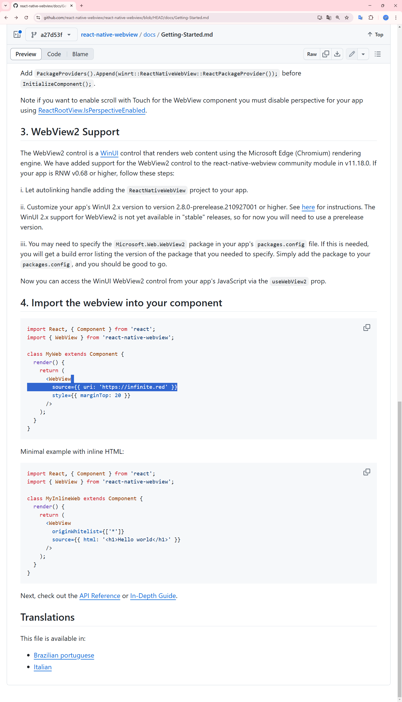

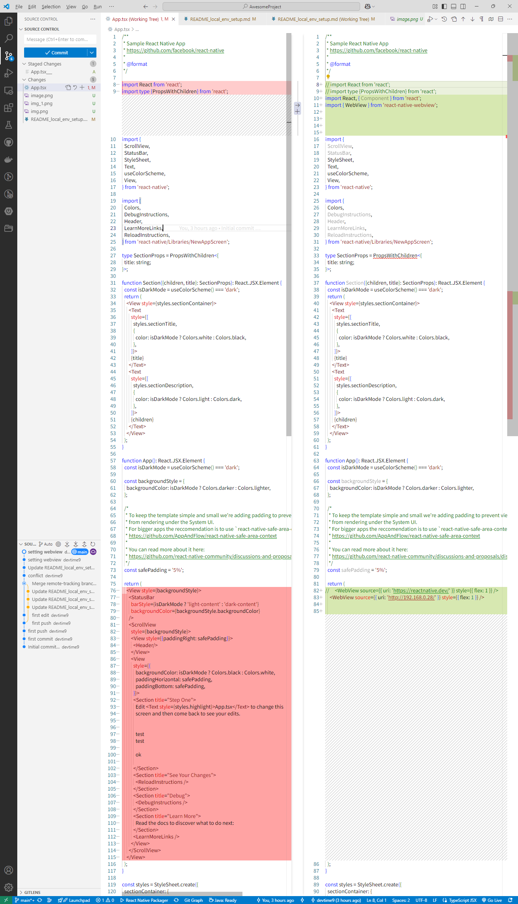

### my domain

    https://app.netlify.com/teams/sangbinlee/dns/dev9.store

### my ip

    nslookup myip.opendns.com. resolver1.opendns.com

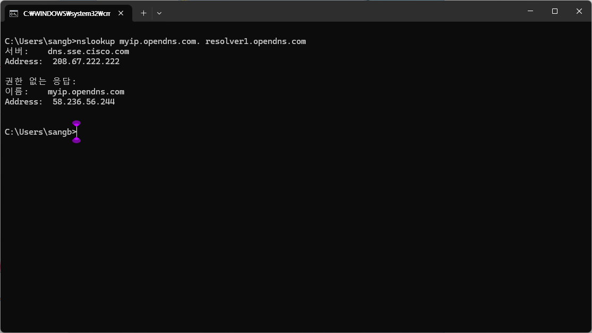

    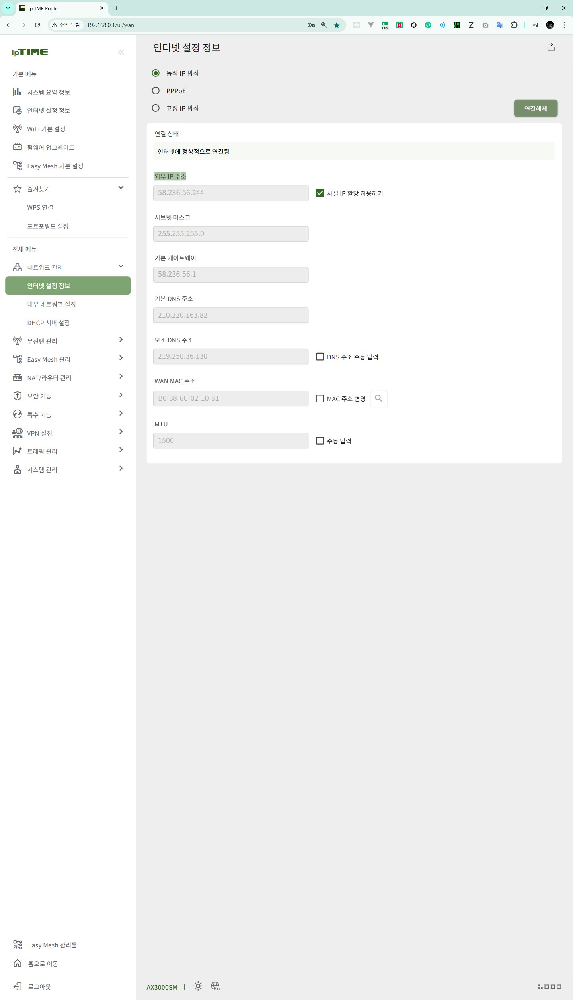

    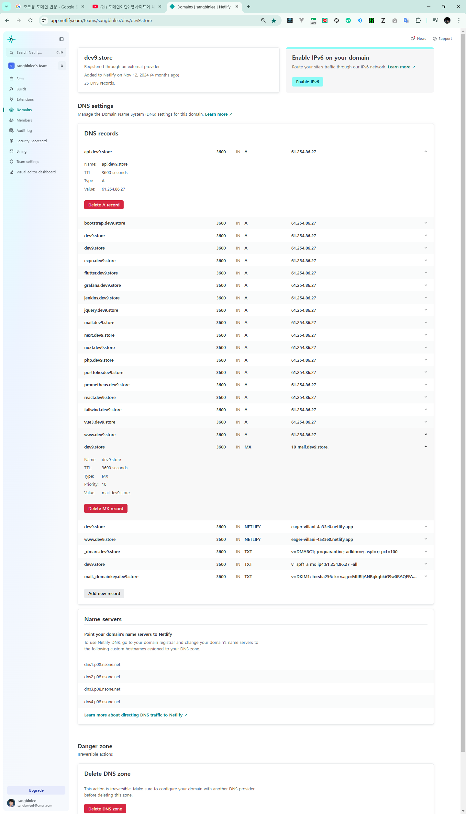

### 구글 배포 전 세팅 끝

    npm run android

    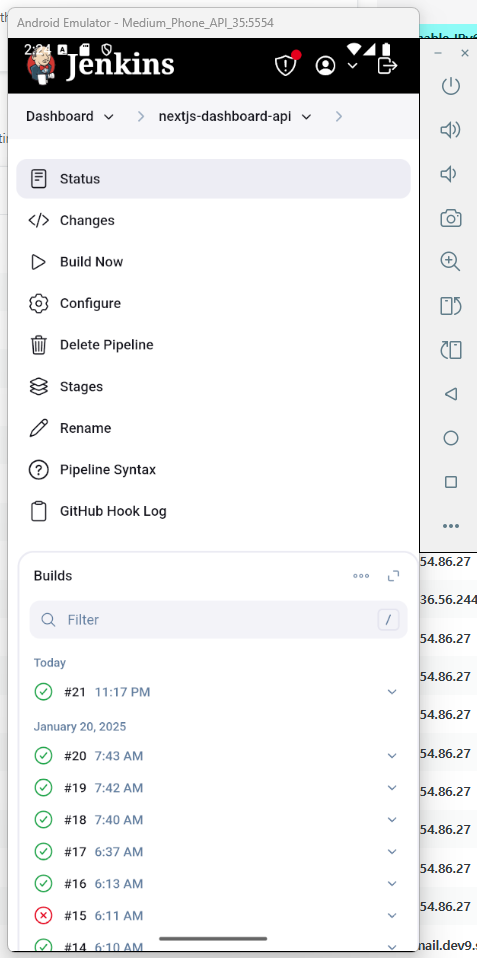

    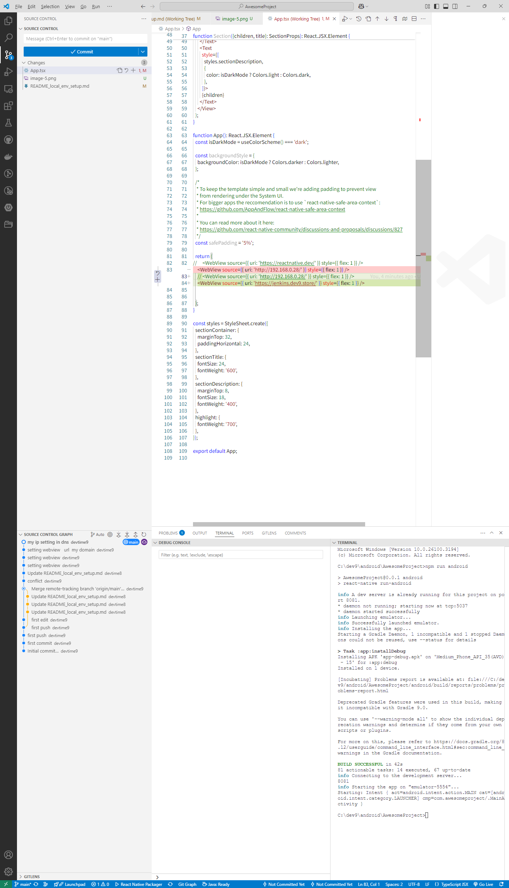

    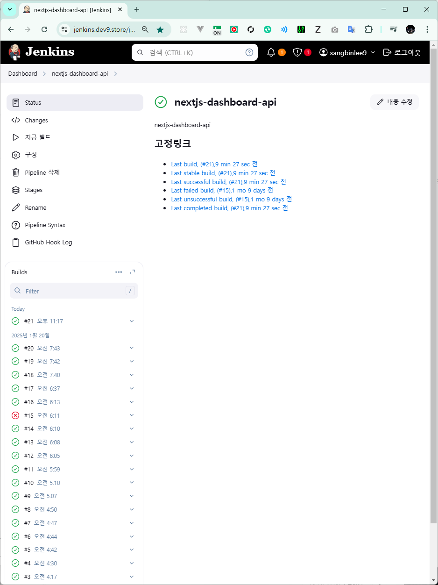

    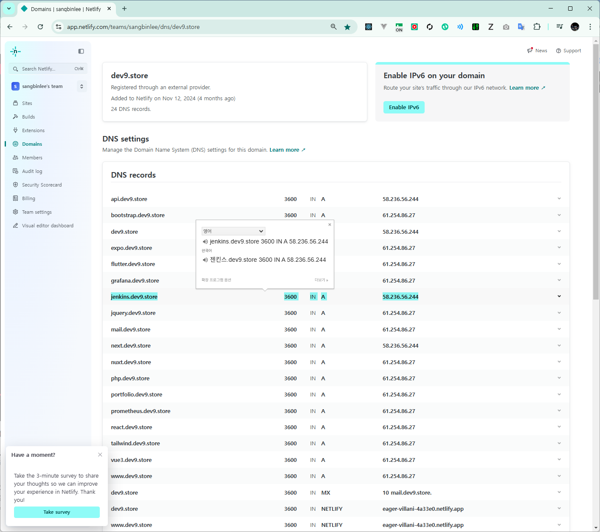

### 캡쳐한 이미지 md 파일에 넣고 push 하면   이미지가 github 에서 안보이는 증상 때문에    설치한 플러그인
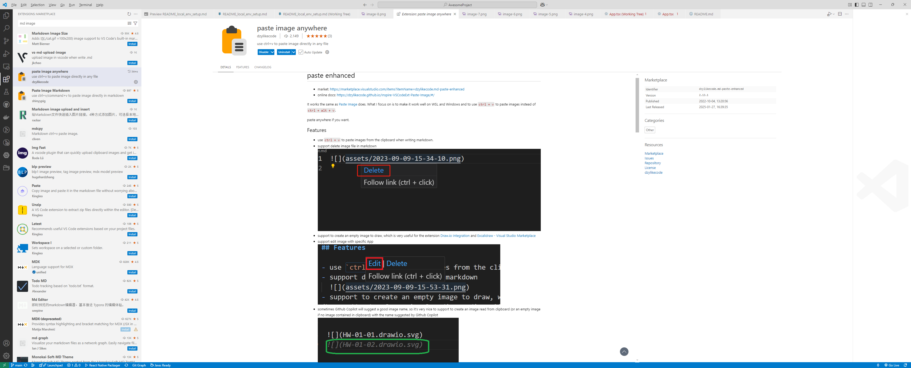

푸시하고 위 이미지 잘보이나??????

### 잘보이네 ㅋㅋ

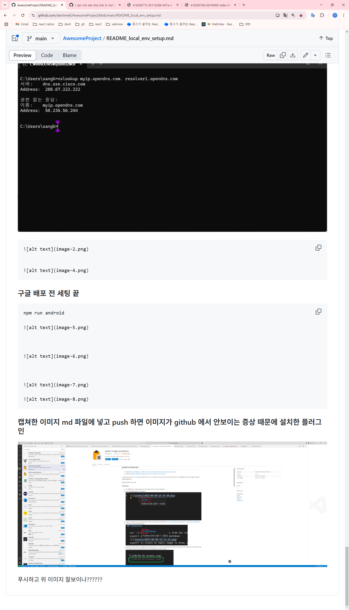

