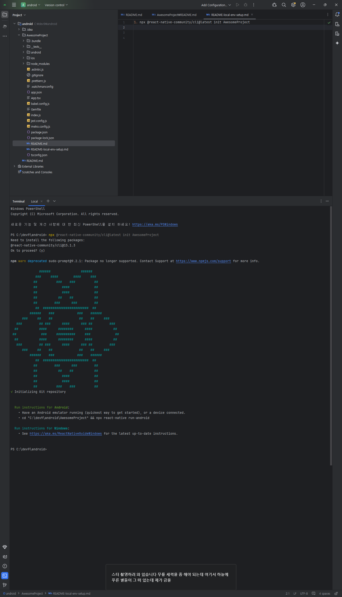
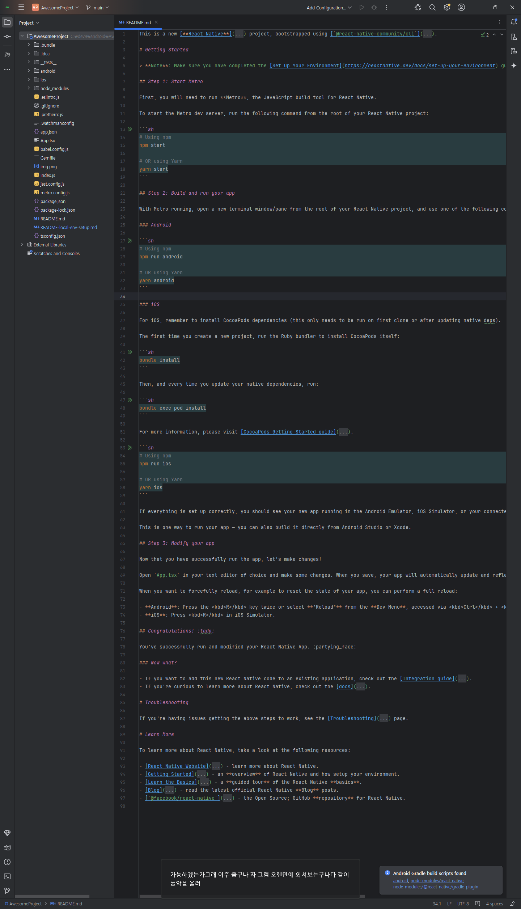

# https://reactnative.dev/docs/getting-started-without-a-framework

## Get Started Without a Framework
 

### Step 1: Creating a new application
    You can use React Native Community CLI to generate a new project. Let's create a new React Native project called "AwesomeProject":
    
        npx @react-native-community/cli@latest init AwesomeProject

        

### open project in android studio

    

### Step 2: Start Metro
    Metro is the JavaScript build tool for React Native. To start the Metro development server, run the following from your project folder:
    
        npm start

        

### Step 3: Start your application

    Let Metro Bundler run in its own terminal. Open a new terminal inside your React Native project folder. Run the following:

    npm run android